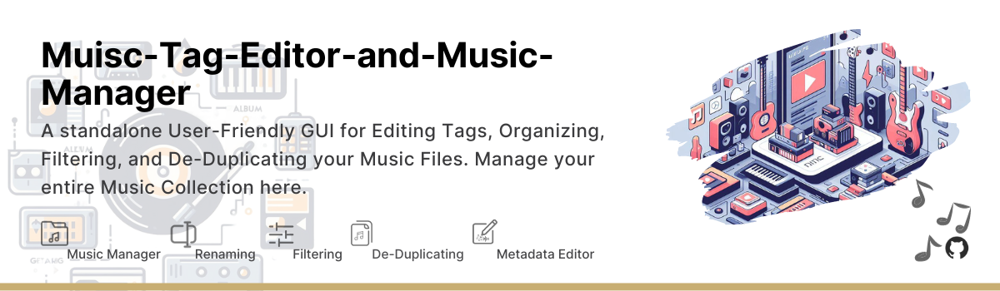
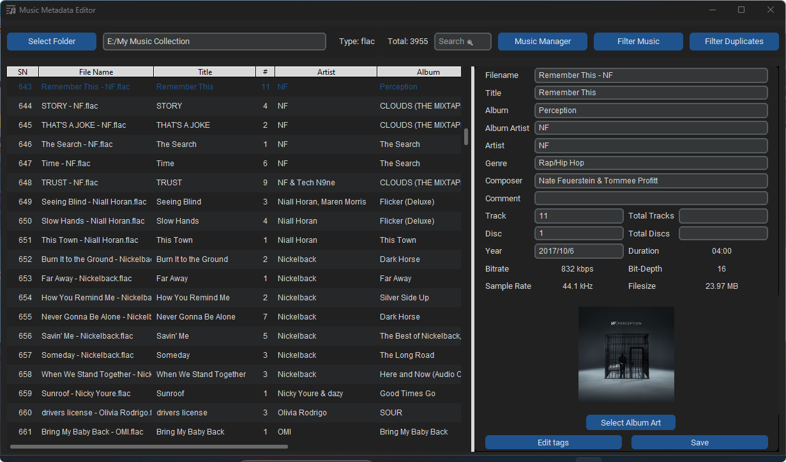
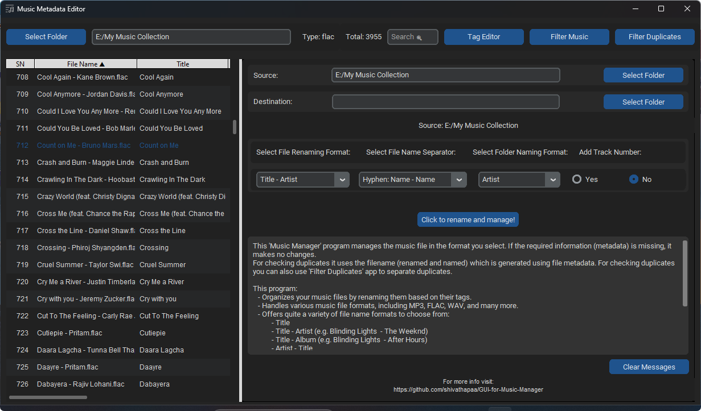
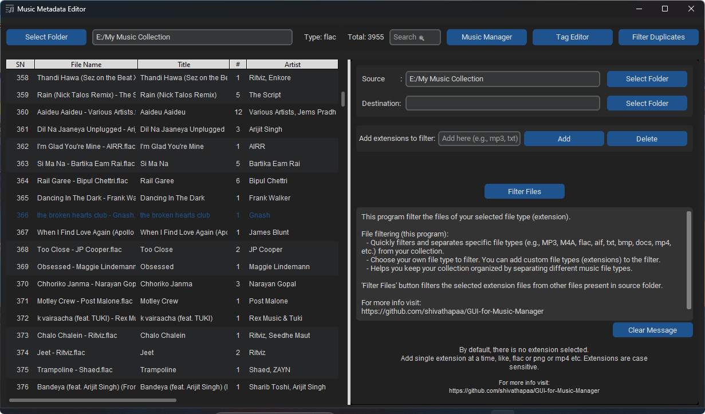
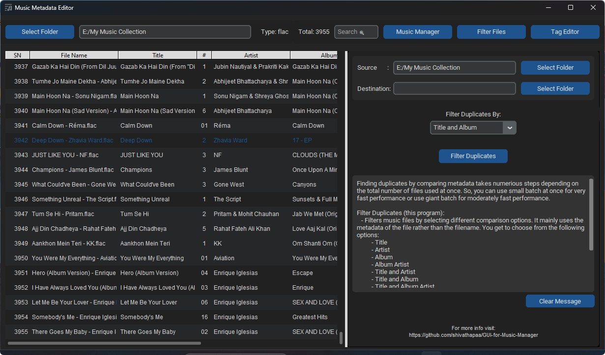

# Music Metadata Editor and Music Manager (GUI)

  

## Overview

The **Music Metadata Editor and Music Manager** is a Python-based desktop application that allows users to view and edit metadata information of music files in their collection. It provides a responsive user interface with a music file list, and offers a tag editor for modifying metadata. It also has three additional features with a user-friendly interface for *renaming music files*, *filtering files* based on extensions, and *finding duplicates* based on different property.

This application consists of three main components:
1. **Music Metadata Editor:**
    - Organize your music files by updating their metadata.
    - Supports various music file formats, such as MP3, FLAC, WAV, AIF, and more.
    - Display a list of music files in the selected folder with information such as filename, title, artist, album, album artist, duration, type, and modified date.
    - Users can edit metadata using the tag editor, and changes can be saved.
    - Editable tag fields include title, album, album artist, artist, genre, composer, comment, track number, total tracks, disc, total discs, year, and artwork.
    - Non-editable fields display information like bitrate, bit-depth, duration, filesize, sample rate, filesize, filetype and modified date.
    - User-friendly GUI with responsive components for efficient metadata view and management.

2. **Music Management:**
   - Organize your music files by renaming them based on their tags. 
   - Handles various music file formats, including MP3, FLAC, WAV, AIF, and many more.
   - Offers quite a variety of file name formats to choose from:
     - Title
     - Title - Artist (e.g. Blinding Lights  - The Weeknd)
     - Title - Album (e.g. Blinding Lights  - After Hours)
     - Artist - Title
     - Title - Album Artist
   - Has options to choose a file name separator for separating tags:
     - Hyphen  --  "Name - Name" (e.g. Blinding Lights  - The Weeknd)
     - Small brackets  --  "Name (Name)" (e.g. Blinding Lights (The Weeknd))
   - Lets you to choose the destination folder names in different formats:
     - Artist (e.g. The Weeknd)
     - Album (e.g. After Hours)
     - Album Artist
   - You can choose to keep the *Track Number* when renaming the file.
   - You can keep track of files with the help of a feedback box (displays counter and details).
   - User-friendly GUI with options to select source and destination folders along with other different options as described above.

3. **File Filtering:**
   - Quickly filter and separate specific file types (e.g., MP3, M4A, txt, bmp, docs, mp4, etc.) from your collection.
   - Choose your own file type to filter. You can add custom file types to the filter.
   - Helps you keep your collection organized by separating different music file types.
   - Here too, you will get a feedback box to make it easier to track your files.
   - User-friendly GUI with an option to add your own custom extension.

4. **Filter Duplicates:**
    - Filters music files by selecting different comparison options. It mainly uses the metadata of the file rather than the filename. You get to choose from the following options:
      - Title
      - Artist
      - Album
      - Album Artist
      - Title and Artist
      - Title and Album
      - Title and Album Artist
    - This script can handle a wide range of music file types, ensuring compatibility with popular formats like .mp3, .flac, .wav, .aif, .m4a, and more.
    - The script provides detailed feedback and error messages, keeping you informed about the progress of the filtering process.
    - User-friendly GUI making it accessible to users of all experience levels.

    > **Note:** *Think Twice before choosing a single tag option for this filter operation.*

    This does not check for the file extensions while comparing, so I recommend first to filter files using the program ***File Filtering*** option (inside the main GUI) if necessary.

## Features

- Easy-to-use GUI for editing and managing music collection.
- Your files are PRESERVED!! There'll be no unnecessary replacing or any duplication when using this app.
- Display a list of music files in the selected folder with information such as filename, title, artist, album, album artist, duration, type, and modified date.
- Users can edit metadata using the tag editor, and changes can be saved.
- Organize music in a variety of formats as you like.
- Filter files for specific file formats (not just limited to music files).
- Filter duplicate files while comparing metadata (more accurate and reliable result).
- Feedback box where you can keep track of all the operations being performed by the program. It gives you a proper feedback message where you can easily monitor the changes.
- Messagebox dialog for events like success, information, alerts, and errors. (Everything is informed in both the feedback box and messagebox dialog so that you can track each and every step.)
- It is a compact yet powerful design for music tag editing and management. It has it all which is needed for basic music editing and music management. (It is a complete version of [Music Manager](https://github.com/shivathapaa/GUI-for-Music-Manager).)

## Getting Started

1. **Download:**
   - Download the latest release from the [Releases](https://github.com/shivathapaa/Muisc-Tag-Editor-and-Music-Manager/releases) section.
   - Extract the downloaded archive to your preferred location on your computer.

2. **Running the Application:**
   - Locate and run the application (e.g., `musicTagEditorGUI.exe`) inside the extracted folder.

3. **Using the 'Music Metadata Editor and Music Manager':**
   - Select the parent source folder of your music collection.
   - Click on any file from the list to get started.
   - *Edit Tags* button enables editing.
   - *Select Album Art* helps you choose new album art cover for the selected music file.
   - Click *"Save"* button saves the changes made. (You'll get proper response message for every task performed.)

4. **Using the Music Collection Manager Feature:**
   - Select the source and destination folders for your music collection.
   - Choose variety of format options for ([refer above](#overview)):
     - File Naming
     - Tag Separating
     - Dest. Folder Naming
     - Including Track Number
   - Click *"Click to rename and manage!"* to organize your music collection.

5. **Using the File Filtering Feature:**
   - Select the source and destination folders for your music collection.
   - Add any file type extensions that you want to separate.
   - You can also delete the file type extensions that you have added without the need for closing the application.
   - Click *"Filter Files"* to separate specific music file formats (e.g., MP3, M4A, txt, jpg, gif, bmp, docs, etc.) from your collection.

6. **Using the Filtering Duplicates Feature:**
   - Select the source and destination folders for your music collection.
   - Choose a variety of format options for metadata comparison. ([refer above](#overview))
   - Click *"Filter Duplicates"* to filter the duplicate files.

## Dependencies

- No external Python dependencies are required when using the built executable.

## Screenshots

- Theme is set based on your system default (dark or light).
- Compact yet powerful! 😉

  
  

  
  
  

## License

This project is licensed under the CC BY-NC 4.0 License - see the [LICENSE](LICENSE) file for details.

## Usage Instructions/Notes

- This application has been tested with extreme cases to extend, for checking its reliability.
- It has been tested with thousands of similar and dissimilar music files. (Gives 100% accuracy. No doubt!)
  > In spite of the best performance, I still recommend you to ensure that you have a backup copy of your music files before using the application. You should be responsible for your own files.
- If you notice any problem, please raise an [issue](https://github.com/shivathapaa/Muisc-Tag-Editor-and-Music-Manager/issues/new/choose).

## Future Updates

- Will optimize code for fast response (*especially search feature*).
- You have something in mind to change or add? I am open to suggestions ([feature request](https://github.com/shivathapaa/Muisc-Tag-Editor-and-Music-Manager/issues/new/choose)).

 

I hope it will be helpful! Enjoy your music!

---
